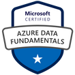

# Portfólio em Cloud

Este repositório contém soluções Cloud que eu desevolvi ou adaptei. Portanto, serve para demonstrar minha vivência nas
plataformas de nuvem, especialmente, AWS.

Foi criado para armazenar projetos-exemplo que sirvam para discutir, avaliar, estudar ou demonstrar boas práticas em
Cloud. Todo material se baseia em fontes reconhecidas (por exemplo, os materiais oferecidos pela própria AWS).

**Badges Relevantes Obtidos em Minha Jornada**

|                          |                                      |                                      |
| :----------------------: | :----------------------------------: | :----------------------------------: |
|                          |    AZ-900 |    DP-900 |
|                          |                |                |
|  |              |              |
|    |                |                                      |

## Índice

1. Aplicações de Demonstração
   1. [Aplicação "Diretório de Funcionários"](#demo-i-diretório-de-funcionários)
   1. [Aplicação "Clima no Campus"](#demo-ii-clima-no-campus)
   1. [Aplicação "Registro de Eventos"](#demo-iii-registro-de-eventos)
1. [AWS Identity and Access Management](#aws-identity-and-access-management-aws-iam)
1. [Segurança](#segurança)
1. [Licença](#licença)

## Demo I "Diretório de Funcionários"

Aplicação proposta pela AWS Training. Clique no link para visualizar como eu
[implementei a solução](Diretorio%20de%20Pessoas#diretório-de-funcionários).

### Pontos a Destacar na Implementação

- Infraestrutura como código (IaC) foi usado;
- O projeto implementa alta disponibilidade via Application Load Balancer (ALB) em múltiplas AZs;
- O projeto prevê segurança 'by design';
  - Os servidores Web **NÃO** possuem IP público, todo acesso se dá via ALB (requer NAT, que tem custo);
  - Os servidores Web aceitam conexões **APENAS** do ALB;
- A aplicação acessa arquivos no S3, mas o S3 **NÃO** está com acesso público;
- Logs de acesso à aplicação Web (obtidos do ALB) são salvos no S3 para auditoria.

Application Load Balancer (ALB) é um dos tipos de Elastic Load Balancer (ELB).

## Demo II "Clima no Campus"

Aplicação proposta pela AWS Training. Clique no link para visualizar como eu
[implementei a solução](serverless#serverless).

### Pontos a Destacar

- Aplicação 100% serverless;
- Implementa uma interface de conversação capaz de lidar com voz e texto;
- O bot para interação é capaz de reconhecimento de fala e compreensão de linguagem natural;
- Uso de CDN para melhorar a experiência no usuário;
- O S3 **NÃO** está com acesso público (apenas o CloudFront pode acessar a origem).

## Demo III "Registro de Eventos"

Aplicação proposta pela AWS Training. Clique no link para visualizar como eu
[implementei a solução](registroEventos#causos-da-roça).

### Pontos de Destaque

- Aplicação 100% serverless;
- Autenticação via Cognito (possui controle de acesso "serverless");
- Utiliza processamento assíncrono (usuário posta uma requisição de forma assíncrona e recebe resposta ao fim do
  processamento);
- Uso de CDN para melhorar a experiência no usuário.

## AWS Identity and Access Management (AWS IAM)

Neste tópico existem notas ao controle de acesso. Salvei alguns exemplos de policy (que eu criei no papel, sem testar)
que são bons indicadores das possibilidades que o IAM oferece.

Clique no link para visualizar [os exemplos que criei](IAM#policies).

O fluxograma abaixo demonstra de forma simplificada [1] como a avaliação sobre conceder ou não direitos a um usuário
funciona. Contudo, muitos outros fatores influenciam esta decisão, como você poder ver
[nesta página](https://docs.aws.amazon.com/IAM/latest/UserGuide/reference_policies_evaluation-logic.html#policy-eval-denyallow).

Para criar policies, beba da fonte mais pura. Use estes exemplos:

- <https://docs.aws.amazon.com/IAM/latest/UserGuide/access_policies_examples.html>

Ou use uma GUI para te auxiliar a iniciar a jornada:

- <https://awspolicygen.s3.amazonaws.com/policygen.html>

[1] Dizer que não se pode restringir o acesso do root user (o usuário root de uma conta AWS, que é o proprietário
principal da conta e tem acesso total a todos os recursos e serviços) é uma simplificação. O root user é o proprietário
da conta e pode administrá-la, mas, via SCP o root pode ser limitado dentro da organização e, via policies, você também
consegue proteger recursos de "erros" de um usuário root. Veja [um exemplo em IAM](IAM/README.md).

## Segurança

Please inspect all packages prior to running any of them to ensure safety. We already know they're safe, but you should
verify the security and contents of any binary from the internet you are not familiar with.

We take security very seriously.

## Licença

GNU General Public License v2.0
