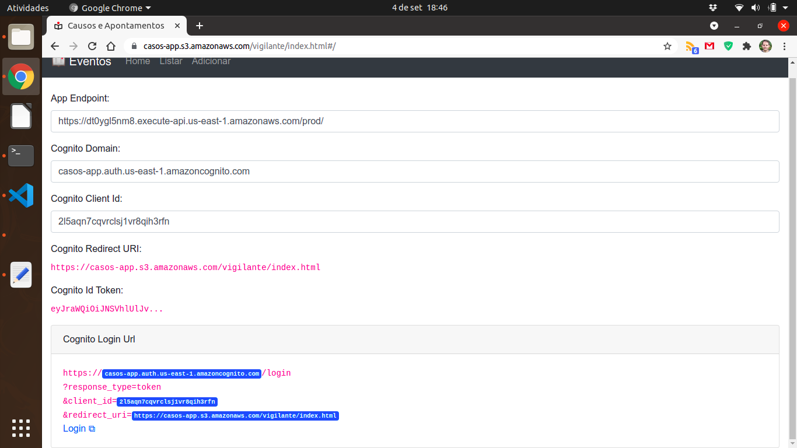
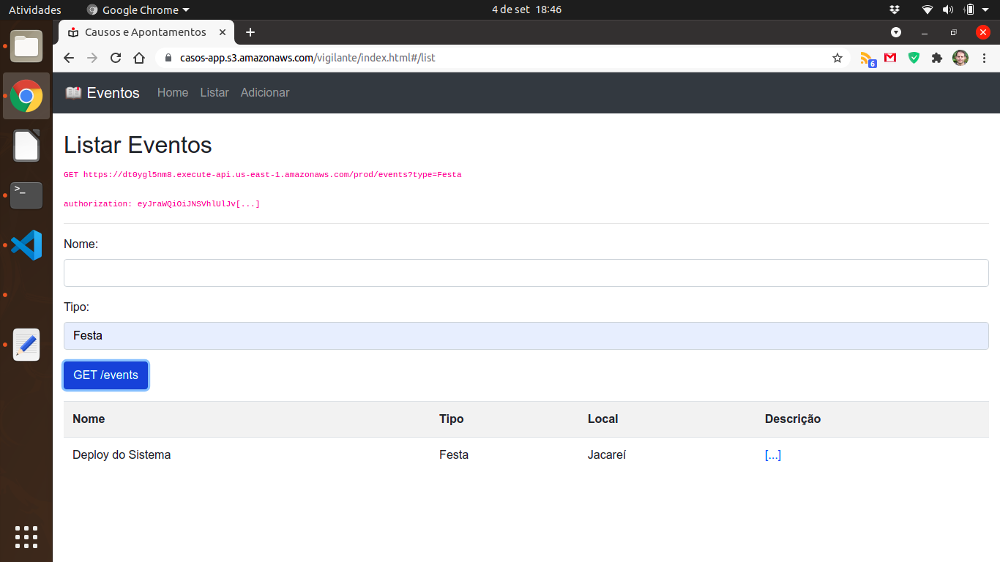
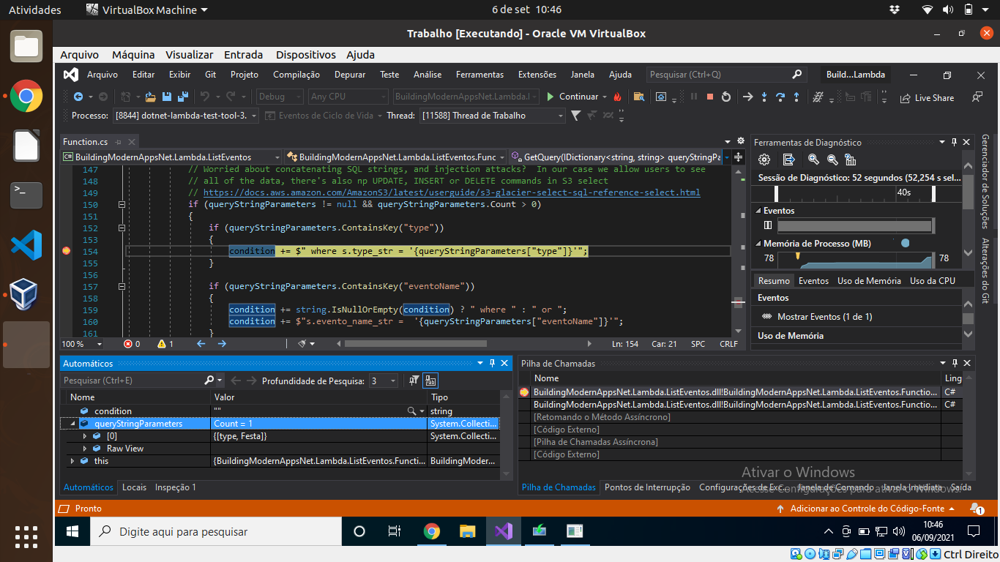
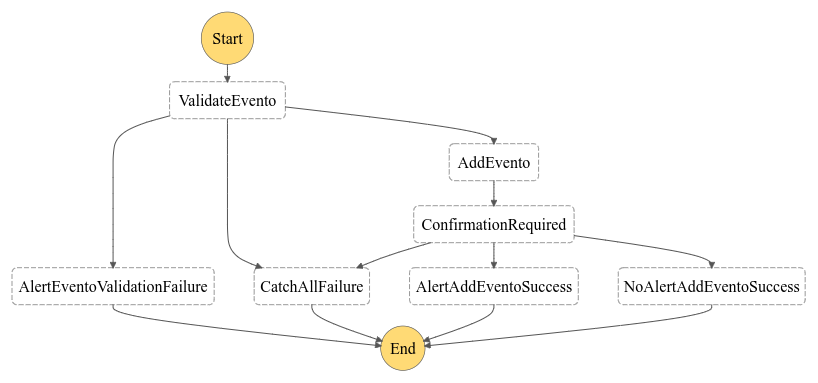
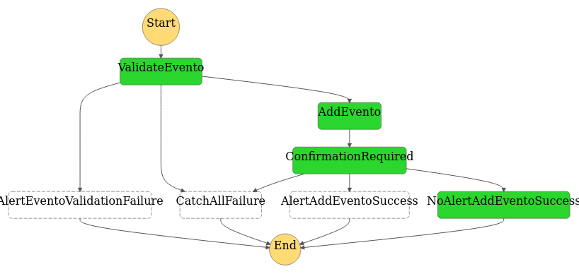
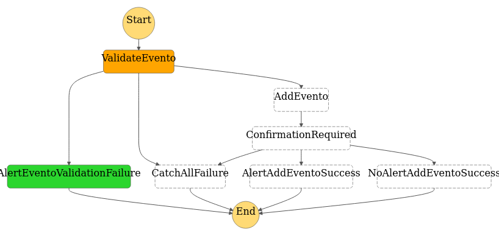
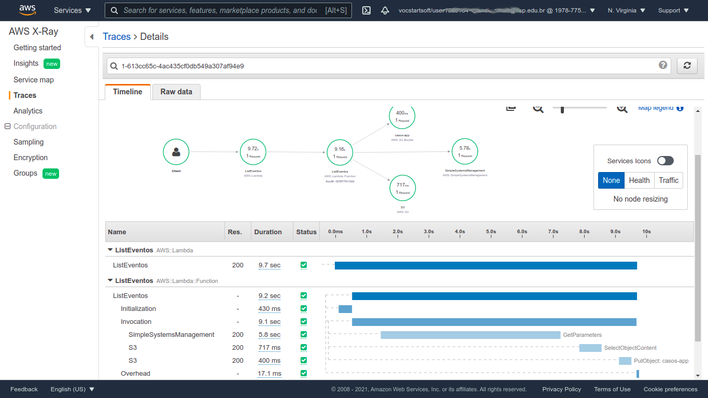
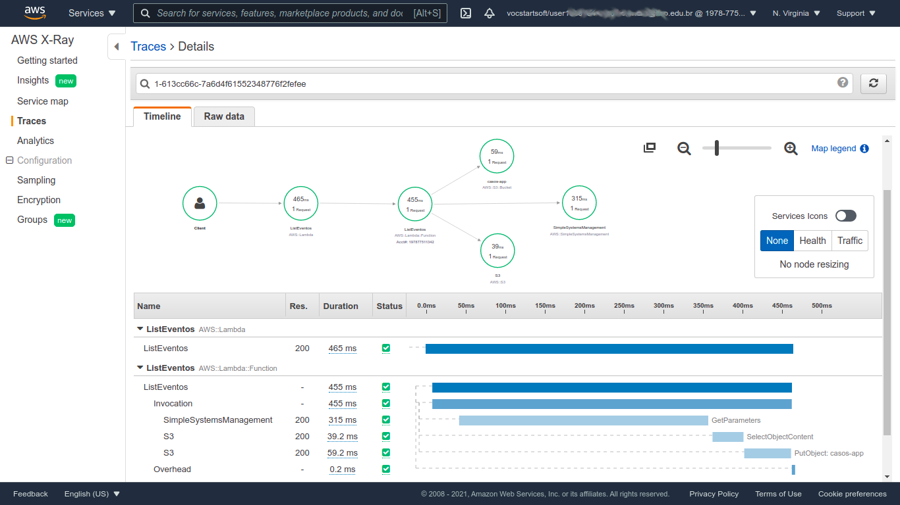

# Causos da Roça

Este diretório contém um aplicativo serverless que demonstra o uso do Cognito e de como acrescentar recursos dinâmicos a
um site estático.

### Aplicação Demo "Registro de Eventos"

Eu fiz um site estático que, via API Gateway, registra os eventos de interesse de seus usuários.

- o objetivo do site é registrar "avistamentos", ocorrências, eventos ou casos. Fatos que forem vistos e que precisem
  ser registrados;
- o site foi concebido para ser um livro ou registro de eventos;
- os dados digitados pelo usuário serão salvos em um banco de dados.

Esta aplicação utiliza os serviços serverless Amazon Cognito, o Amazon CloudFront, o Amazon API Gateway, AWS Lambda, AWS
Step Functions e o Amazon S3. A aplicação contém:

- uma interface web (site estático);
- baixa latência via CDN (API Gateway via Endpoint Type);
- persistência de dados em um banco de dados qualquer;

### Como Tudo Funciona

Acesse o app via (**desabilidado**):

- <https://casos-app.s3.amazonaws.com/vigilante/index.html>

Configure a aplicação com estes dados (para facilitar a experimentação, o Front End é de testes e desenvolvimento, a
configuração fica salva em um cookie).

- Endpoint (**desabilidado**):
  - <https://dt0ygl5nm8.execute-api.us-east-1.amazonaws.com/prod/>
- Cognito Domain (**desabilidado**):
  - [casos-app.auth.us-east-1.amazoncognito.com](casos-app.auth.us-east-1.amazoncognito.com)
- Cognito Client Id:
  - 2l5aqn7cqvrclsj1vr8qih3rfn

Preencha os campos e clique em Login na parte inferior da tela:

O funcionamento da aplicação é intuitivo. Selecione os "botões" _Home_, _Listar_ ou _Adicionar_ na barra superior na
tela:

Funcionamento:

- configure a aplicação conforme visto acima;
- vá até a parte inferior da tela e clique em Login;
- crie um usuário (use um email temporário como o Mailinator, se preferir);
- a autenticação ocorre via Cognito;
- após o login o campo "Cognito Id Token" é preenchido:
- o frontend estático em HTML chama uma API REST definida no API Gateway;
- a API Gateway repassa a chamada para uma função lambda;
- a inclusão de um novo Evento se dá de forma assíncrona, via Step Functions;
  - feito para demonstrar processamento assíncrono de um evento em uma aplicação (por exemplo, inclusão de pedidos, que
    envolve muitas atividades e que precisamos que seja feito de forma escalável no backend);
- funções lambda salvam ou recuperam os dados em um banco de dados.

Observação:

- os dados acima são de uma conta Vocareum;
- como contas Vocareum não permitem Step Functions, a aplicação publicada funciona de forma síncrona;
  - sem a função valida() e sem notificação;
- eu testei o funcionamento assíncrono na minha própria conta.

A aplicação é:

- 100% serverless.
- o acesso é otimizado para a borda via CDN;
- esta otimização na borda me deu alguns problemas com o cache.

### Desenvolvimento e Depuração

Desenvolver e depurar código lambda não é tão complicado como muita gente anuncia por aí. Na realidade, o
desenvolvimento .NET com a IDE Visual Studio segue, basicamente, o mesmo padrão de um "desenvolvimento de um app
normal". É possível:

- usar a interface gráfica da IDE;
- ativar e avaliar o status do programa via breakpoints;
- avaliar o valor de variáveis durante a execução;
- além do padrão seguido desde o VB 6 sobre como se depura um programa, o Visual Studio também oferece outros recursos,
  como por exemplo, a possibilidade de publicar a função lambda diretamente da IDE, ou ainda, os dados sobre a execução
  do programa.

A versão usada para desenvolvimento e testes da aplicação foi a Visual Studio Community 2019, sem custo algum.

Pontos a destacar:

- note que a função usa 78MB de memória (lado direito da tela). Ao configurá-la no lambda, nós sabemos que o mínimo de
  128MB é o suficiente;
- note o breakpoint na linha 154 (lado esquerdo da tela).
- note o valor das variáveis (lado esquerdo inferior da tela). Condition ainda está em branco, queryString possui um
  valor.

### A Máquina de Estados

O diagrama da máquina de estados usado para funcionamento assíncrono, via Step Functions, em uso no processamento para
salvar dados novos:

O diagrama da máquina de estados quando evento é incluído (um evento novo é informado):

O diagrama da máquina de estados quando evento não é válido (um evento que já existe cadastrado é informado):

### Analisando a Aplicação com X-Ray

AWS X-Ray ajuda desenvolvedores a analisar uma aplicaçõe. Abaixo, note a enorme diferença entre o cold start e o warm
start em uma função lambda:

- Um “Cold start” é a primeira solicitação que um environment do Lambda atende. Essa solicitação leva mais tempo para
  ser processada porque o serviço Lambda precisa encontrar um espaço em uma máquina para alocar e inicializar o
  worker/container/environment.

- Observe que um "warm start" é quase 20 vezes mais rápido.
- Repare, ainda, que não precisamos "pegar" novamente os valores no Parameter Store, portanto, ainda há espaço para
  melhorias.

