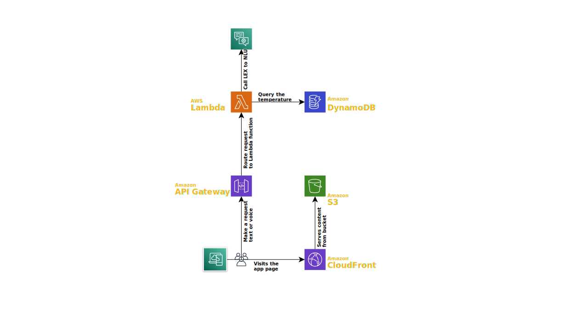
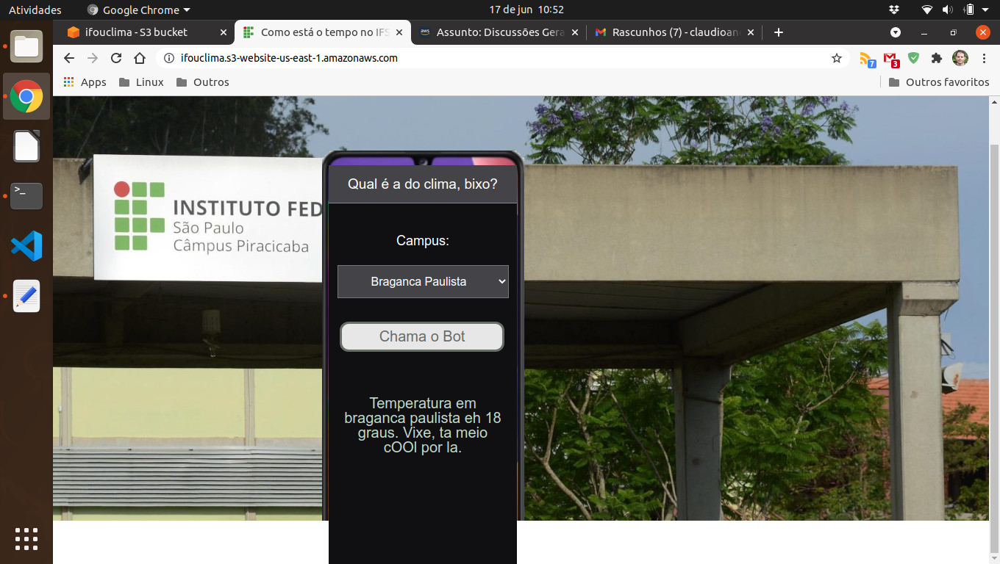
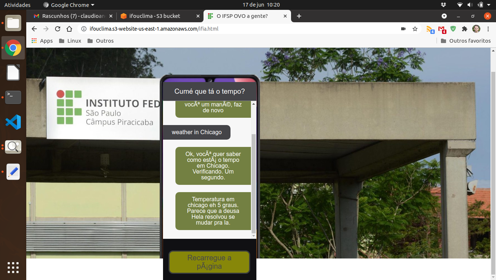

# Serverless

Este diretório contém uma aplicação que usa uma série de serviços serverless da AWS. A aplicação original foi criada
pelo time de treinamento AWS para demonstrar como utilizar a AWS. Adaptei para o meu caso de uso.

Deve ser possível testar este ambiente na sua conta sem alterações. Eu **não** usei _infra como código_ (IaC), portanto,
algumas funcionalidades foram implementadas diretamente na AWS e você não conseguirá vê-las aqui.

### Aplicação Demo "Qual o clima no Campus do IFSP"

Eu fiz um app que mostra a temperatura nos Campus do IF [1].

- O site é o "IFô u clima";
- O assistente virtual/pessoal é a "IF iá".

Esta aplicação utiliza os serviços serverless Amazon LEX, o Amazon CloudFront, o Amazon DynamoDB, o Amazon API Gateway e
o Simple Storage Service (S3). A aplicação contém:

- Um bot com reconhecimento de fala e compreensão de linguagem natural (em inglês, o Amazon LEX ainda não suporta
  pt-BR);
- Uma interface web que informa o clima no campus selecionado;
- Baixa latência via CDN e acesso restrito à origem no S3;
- Persistência de dados;

[1] À priori precisa usar o Chrome, o javascript pode não funcionar em outros navegadores.

### Como Tudo Funciona

O app tem duas interfaces de acesso:

- interface texto:
  - via S3 http://ifouclima.s3-website-us-east-1.amazonaws.com/ [leia o item 1 abaixo];
  - usando HTTPS https://ifouclima.s3.amazonaws.com/text.html [*];
  - uma função lambda é chamada que consulta um banco de dados DynamoDB.
- interface voz, via "assistente virtual" (com ajuda da API do Chrome):
  - via S3 http://ifouclima.s3-website-us-east-1.amazonaws.com/ifia.html [leia o item 2 abaixo];
  - usando HTTPS https://ifouclima.s3.amazonaws.com/ifia.html [*];
  - uma função lambda é chamada que consulta um bot LEX.

[*] Via _Legacy Global Endpoint_: algo do tipo _bucket-name.s3.amazonaws.com_. Requisições feitas usando o "legacy
global endpoint" são direcionadas para US East (N. Virginia) por padrão. Leia mais em
https://docs.aws.amazon.com/AmazonS3/latest/userguide/VirtualHosting.html.

A aplicação é:

- 100% serverless.
- o acesso seria/será via CDN [leia a observação e o item 3 abaixo].

Obs: estou usando a conta Vocareum e eles são pessoas más que não gostam que a gente use os créditos que eles "dão". Só
vou criar CDN quando migrar tudo pra uma conta AWS pessoal. Como pode ter custo, estou postergando.

[1] o acesso não devia ocorrer via S3 (ou seja, S3 não teria acesso público. Como ele é a origem, é função do arquiteto
proteger/ocultar/resguardar).

[2] eu criei um bot LEX, treinei com algumas perguntas, mas o reconhecimento de fala quem faz é o Chrome, os dados são
enviados em texto para o bot, que interpreta via compreensão de linguagem natural e valida o texto. Aliás, o inglês da
moça do Chrome é padrão Joel Santana. Ela não reconhece as cidades do Brasil, então, se alguém for testar, use Miami,
Los Angeles, etc. Você deve perguntar em inglês ou só dizer o nome da cidade.

[3] todo o acesso seria feito via CDN, sem acesso público ao S3. Mas a conta Vocareum bloqueia o CloudFront.

### Interface Texto do app

A interface texto é bem óbvia:

- Selecione os dados e clique no botão. 

PS: a lista de todas as cidades que ele reconhece para serem ditas na interface voz está listada no combo box.

### Interface Voz do app

Inicio da comunicação:

- Apertei o botão para falar;
- Falei em voz alta "weather in Chicago";
  - Uma pergunta foi feita (usando a voz) em inglês;
- O reconhecimento da fala ocorreu e o texto apareceu na tela de "chat".
  

A primeira execução deu timeout (algo relativamente comum):

- A pergunta foi, então, refeita e a resposta foi obtida;
- Você deve reiniciar sua sessão recarregando o site (basta apertar F5).
  

PS:

- Todos os textos que aparecem na tela do chat o Chrome "fala" em voz alta.
- É interessante, a moça do Chrome lê bem português, mas ela não entende português "falado".
- E quando ela lê inglês, ai!, o resultado é exótico.
- O bot LEX entende inglês (não tinha opção de pt-BR), mas a interface eu faço como quiser.
- Interessante, Alexa fala português, mas minha conta não tem português como suportado no Amazon LEX.

### Permissões no Chrome (DEPRECATED)

Se você usar o endereço do site estático do S3 (Amazon S3 static website address) terá que "forçar" para usar o
microfone no Chrome (Chrome bloqueia o acesso a alguns recursos se o site não usar https).

Recomendo com veemência que você use o [link do tipo](https://ifouclima.s3.amazonaws.com/ifia.html) _virtual-host-style
addressing over HTTPS_, e não tenha esta limitação. Claro, você ainda terá que liberar o acesso ao microfone para o site
"IFô u clima".

Se preferir ou precisar acessar usando HTTP, então:

1. Como o S3 static hosting não suporta https, você precisa confiar no site http "ifô u clima"
2. No Chrome, acesse
   [chrome://flags/#unsafely-treat-insecure-origin-as-secure](chrome://flags/#unsafely-treat-insecure-origin-as-secure)
3. E inclua o site http://ifouclima.s3-website-us-east-1.amazonaws.com na sua lista de autorizados, conforme você vê na
   image: 

### Casos de Uso

Aprender como usar AWS e serverless.

Elegível para o nível gratuito. Elegible for the free tier.

IMPORTANT: The total cost of your sessions on AWS will vary depending on your usage and whether you are outside the AWS
Free Tier limits.
